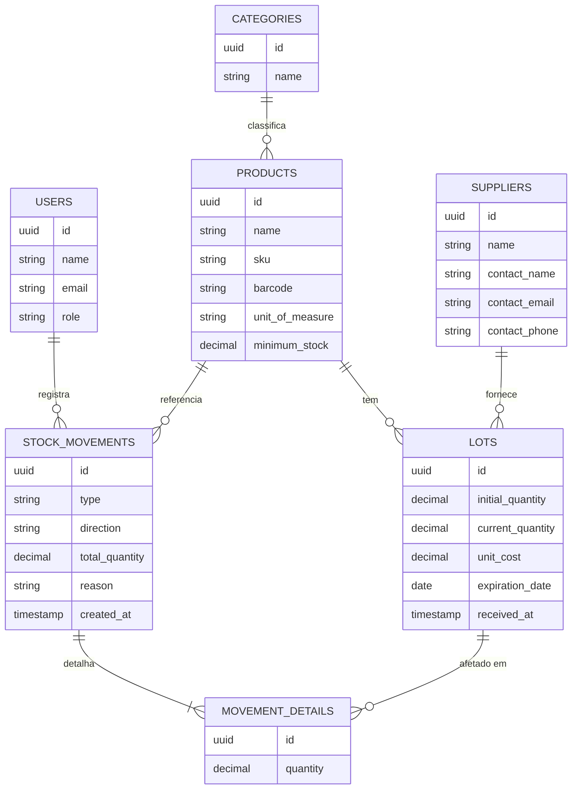
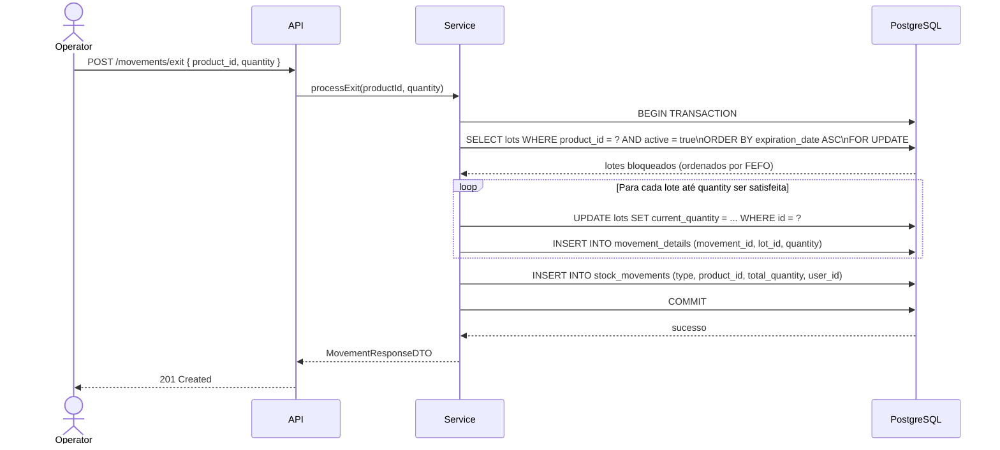

# Lotrack — Modelagem de Dados do MVP

<br />

## 1. Introdução

Este documento descreve o modelo de dados do MVP do Lotrack. Está organizado em três níveis: o modelo conceitual (visão de negócio, sem tipos de dados), o modelo lógico (tabelas, colunas, tipos e constraints) e as decisões de modelagem que justificam as escolhas feitas, em especial as que envolvem rastreabilidade e concorrência.

<br />

## 2. Modelo Conceitual

O diagrama abaixo representa as entidades centrais do domínio e seus relacionamentos, independentemente de tecnologia.



### 2.1 Descrição das Entidades

| Entidade          | Responsabilidade no domínio                                                                                                                                     |
| ------------------- | ------------------------------------------------------------------------------------------------------------------------------------------------------------------ |
| `USERS`             | Representa os operadores do sistema. Carrega o perfil de acesso (role) e os dados necessários para a auditoria de quem fez cada movimentação.                      |
| `CATEGORIES`        | Agrupa produtos por tipo (ex.: medicamentos, alimentos perecíveis). Usado em filtros e relatórios.                                                                 |
| `PRODUCTS`          | Representa um item controlado em estoque. Contém a identidade do produto (SKU, código de barras) e a quantidade mínima que dispara alerta.                         |
| `SUPPLIERS`         | Representa o fornecedor do qual um lote foi recebido. Vinculado a cada lote individualmente, não ao produto, pois o mesmo produto pode ter fornecedores diferentes por entrada. |
| `LOTS`              | Representa uma unidade de rastreabilidade: um conjunto de itens de um mesmo produto, recebido de um fornecedor em uma data, com uma validade e um custo específicos. O lote é a unidade sobre a qual o FEFO é aplicado. |
| `STOCK_MOVEMENTS`   | Cabeçalho de toda movimentação de estoque. Registra o tipo da operação, o produto afetado, a quantidade total e o usuário responsável. É imutável após criação.     |
| `MOVEMENT_DETAILS`  | Detalhe de uma movimentação por lote. Para saídas que consomem múltiplos lotes, há um registro de detalhe por lote consumido. Também imutável após criação.         |

<br />

## 3. Modelo Lógico

### 3.1 Tabela: `users`

Armazena os usuários do sistema. O perfil (`role`) é um enum fixo com três valores: `ADMIN`, `OPERATOR` e `VIEWER`. Os campos `failed_login_attempts` e `locked_until` suportam o mecanismo de bloqueio por força bruta.

| Coluna                  | Tipo                        | Restrições                                          | Descrição                                                              |
| ------------------------- | ------------------------------ | ----------------------------------------------------- | ------------------------------------------------------------------------- |
| `id`                      | `uuid`                         | PK, not null, default gen_random_uuid()               | Identificador único                                                        |
| `name`                    | `varchar(150)`                 | not null                                              | Nome do usuário                                                            |
| `email`                   | `varchar(254)`                 | not null, unique                                      | E-mail (usado como login)                                                  |
| `password_hash`           | `varchar(72)`                  | not null                                              | Hash bcrypt da senha (custo mínimo 10)                                     |
| `role`                    | `varchar(20)`                  | not null, check (ADMIN, OPERATOR, VIEWER)             | Perfil de acesso                                                           |
| `active`                  | `boolean`                      | not null, default true                                | Indica se o usuário pode acessar o sistema                                 |
| `failed_login_attempts`   | `smallint`                     | not null, default 0                                   | Contador de tentativas de login inválidas consecutivas                     |
| `locked_until`            | `timestamptz`                  | null                                                  | Quando preenchido, indica até quando o login está bloqueado                |
| `created_at`              | `timestamptz`                  | not null, default now()                               | Data de criação                                                            |
| `updated_at`              | `timestamptz`                  | not null, default now()                               | Data da última atualização                                                 |

---

### 3.2 Tabela: `categories`

Agrupa produtos por tipo para facilitar filtros e organização visual.

| Coluna        | Tipo            | Restrições                          | Descrição               |
| --------------- | ---------------- | ------------------------------------- | -------------------------- |
| `id`            | `uuid`           | PK, not null, default gen_random_uuid() | Identificador único      |
| `name`          | `varchar(100)`   | not null, unique                      | Nome da categoria         |
| `description`   | `text`           | null                                  | Descrição opcional        |
| `active`        | `boolean`        | not null, default true                | Soft delete               |
| `created_at`    | `timestamptz`    | not null, default now()               | Data de criação           |
| `updated_at`    | `timestamptz`    | not null, default now()               | Data da última atualização |

---

### 3.3 Tabela: `products`

Representa um item controlado em estoque. O `sku` é o identificador operacional do produto e deve ser único. O `barcode` é opcional e também deve ser único quando informado, para evitar duplicidade acidental.

| Coluna           | Tipo           | Restrições                                | Descrição                                                            |
| ------------------ | --------------- | ------------------------------------------- | ----------------------------------------------------------------------- |
| `id`               | `uuid`          | PK, not null, default gen_random_uuid()     | Identificador único                                                      |
| `category_id`      | `uuid`          | FK → categories(id), not null               | Categoria do produto                                                     |
| `name`             | `varchar(200)`  | not null                                    | Nome do produto                                                          |
| `sku`              | `varchar(100)`  | not null, unique                            | Código de estoque — identificador operacional                            |
| `barcode`          | `varchar(100)`  | null, unique                                | Código de barras (EAN-13 ou similar); único quando informado             |
| `unit_of_measure`  | `varchar(20)`   | not null                                    | Unidade de medida (ex.: un, kg, l, cx)                                  |
| `minimum_stock`    | `DECIMAL(15,4)` | not null, default 0, check (>= 0)           | Quantidade mínima que dispara o alerta de estoque baixo                  |
| `active`           | `boolean`       | not null, default true                      | Soft delete                                                              |
| `created_at`       | `timestamptz`   | not null, default now()                     | Data de criação                                                          |
| `updated_at`       | `timestamptz`   | not null, default now()                     | Data da última atualização                                               |

---

### 3.4 Tabela: `suppliers`

Representa o fornecedor do qual um lote foi recebido. Vinculado por lote, não por produto.

| Coluna          | Tipo           | Restrições                          | Descrição                         |
| ----------------- | --------------- | ------------------------------------- | ------------------------------------ |
| `id`              | `uuid`          | PK, not null, default gen_random_uuid() | Identificador único               |
| `name`            | `varchar(200)`  | not null                              | Nome do fornecedor                  |
| `contact_name`    | `varchar(150)`  | null                                  | Nome da pessoa de contato           |
| `contact_email`   | `varchar(254)`  | null                                  | E-mail de contato                   |
| `contact_phone`   | `varchar(30)`   | null                                  | Telefone de contato                 |
| `active`          | `boolean`       | not null, default true                | Soft delete                         |
| `created_at`      | `timestamptz`   | not null, default now()               | Data de criação                     |
| `updated_at`      | `timestamptz`   | not null, default now()               | Data da última atualização          |

---

### 3.5 Tabela: `lots`

O lote é a unidade central de rastreabilidade. Cada entrada de estoque cria um novo registro aqui. O `current_quantity` é o saldo atual do lote — diminuído a cada saída, descarte ou ajuste negativo sobre ele, e nunca editado diretamente fora de uma transação de movimentação.

| Coluna             | Tipo            | Restrições                                     | Descrição                                                              |
| -------------------- | ---------------- | ------------------------------------------------ | ------------------------------------------------------------------------- |
| `id`                 | `uuid`           | PK, not null, default gen_random_uuid()          | Identificador único                                                        |
| `product_id`         | `uuid`           | FK → products(id), not null                      | Produto ao qual este lote pertence                                         |
| `supplier_id`        | `uuid`           | FK → suppliers(id), not null                     | Fornecedor do qual foi recebido                                            |
| `lot_number`         | `varchar(100)`   | null                                             | Número do lote informado pelo fornecedor (opcional, para rastreabilidade externa) |
| `initial_quantity`   | `DECIMAL(15,4)`  | not null, check (> 0)                            | Quantidade recebida na entrada (imutável após criação)                     |
| `current_quantity`   | `DECIMAL(15,4)`  | not null, check (>= 0)                           | Saldo atual do lote — atualizado transacionalmente a cada movimentação     |
| `unit_cost`          | `DECIMAL(15,4)`  | not null, check (>= 0)                           | Custo unitário no momento da entrada                                       |
| `expiration_date`    | `date`           | not null                                         | Data de validade do lote — base do critério FEFO                           |
| `received_at`        | `timestamptz`    | not null, default now()                          | Data e hora em que o lote foi registrado no sistema                        |
| `active`             | `boolean`        | not null, default true                           | Inativado quando `current_quantity` chega a zero ou em caso de descarte total |
| `created_at`         | `timestamptz`    | not null, default now()                          | Data de criação                                                            |
| `updated_at`         | `timestamptz`    | not null, default now()                          | Data da última atualização                                                 |

---

### 3.6 Tabela: `stock_movements`

Cabeçalho de cada operação de movimentação. Imutável após criação — representa um fato ocorrido, não um estado editável.

O campo `direction` é relevante apenas para movimentações do tipo `ADJUSTMENT` (indica se o ajuste é positivo ou negativo). Para os demais tipos, o sentido é implícito no próprio tipo. O campo `reason` é obrigatório para `DISPOSAL` e `ADJUSTMENT` e deve ser nulo para `ENTRY` e `EXIT`.

| Coluna           | Tipo             | Restrições                                                    | Descrição                                                                 |
| ------------------ | ----------------- | --------------------------------------------------------------- | ---------------------------------------------------------------------------- |
| `id`               | `uuid`            | PK, not null, default gen_random_uuid()                         | Identificador único                                                           |
| `type`             | `varchar(20)`     | not null, check (ENTRY, EXIT, DISPOSAL, ADJUSTMENT)             | Tipo da movimentação                                                          |
| `direction`        | `varchar(10)`     | null, check (INCREASE, DECREASE)                                | Direção do ajuste; preenchido somente quando `type = ADJUSTMENT`             |
| `product_id`       | `uuid`            | FK → products(id), not null                                     | Produto movimentado                                                           |
| `total_quantity`   | `DECIMAL(15,4)`   | not null, check (> 0)                                           | Quantidade total da movimentação (valor absoluto)                             |
| `reason`           | `text`            | null                                                            | Motivo — obrigatório para DISPOSAL e ADJUSTMENT; nulo para ENTRY e EXIT      |
| `user_id`          | `uuid`            | FK → users(id), not null                                        | Usuário que registrou a movimentação                                          |
| `created_at`       | `timestamptz`     | not null, default now()                                         | Timestamp imutável da operação                                                |

> **Nota de imutabilidade:** esta tabela não possui `updated_at`. Ausência intencional — movimentação não é atualizada jamais.

---

### 3.7 Tabela: `movement_details`

Detalha quais lotes foram afetados em uma movimentação e em qual quantidade. Uma movimentação de saída que consuma três lotes gera três registros aqui. Também imutável após criação.

| Coluna          | Tipo            | Restrições                              | Descrição                                                             |
| ----------------- | ---------------- | ----------------------------------------- | ------------------------------------------------------------------------ |
| `id`              | `uuid`           | PK, not null, default gen_random_uuid()   | Identificador único                                                       |
| `movement_id`     | `uuid`           | FK → stock_movements(id), not null        | Movimentação à qual pertence este detalhe                                 |
| `lot_id`          | `uuid`           | FK → lots(id), not null                   | Lote afetado                                                              |
| `quantity`        | `DECIMAL(15,4)`  | not null, check (> 0)                     | Quantidade consumida ou adicionada neste lote nesta operação (sempre positivo; o sentido é dado pelo tipo da movimentação pai) |
| `created_at`      | `timestamptz`    | not null, default now()                   | Timestamp imutável                                                        |

> **Nota de imutabilidade:** esta tabela também não possui `updated_at`. Mesma razão da tabela pai.

<br />

## 4. Índices

Os índices abaixo são criados além das PKs e FKs (que o PostgreSQL indexa automaticamente).

| Tabela              | Coluna(s)                              | Tipo   | Justificativa                                                                                  |
| --------------------- | --------------------------------------- | ------- | -------------------------------------------------------------------------------------------------- |
| `users`               | `email`                                 | Unique  | Lookup de login                                                                                    |
| `products`            | `sku`                                   | Unique  | Busca por SKU no registro de entrada e busca textual                                               |
| `products`            | `barcode`                               | Unique (partial: where barcode is not null) | Busca por leitura de código de barras; parcial para não indexar nulos       |
| `products`            | `category_id`                           | B-tree  | Filtro de produtos por categoria                                                                   |
| `lots`                | `product_id, expiration_date`           | B-tree  | Consulta FEFO: todos os lotes ativos de um produto ordenados por validade (hotpath crítico)        |
| `lots`                | `product_id, active`                    | B-tree  | Cálculo de saldo e listagem de lotes ativos por produto                                            |
| `lots`                | `expiration_date`                       | B-tree  | Consulta de alertas de vencimento próximo                                                          |
| `stock_movements`     | `product_id, created_at`               | B-tree  | Histórico de movimentações por produto em ordem cronológica                                        |
| `stock_movements`     | `user_id`                               | B-tree  | Auditoria: quem fez cada movimentação                                                              |
| `movement_details`    | `movement_id`                           | B-tree  | Busca de todos os detalhes de uma movimentação (geração de recibo)                                 |
| `movement_details`    | `lot_id`                                | B-tree  | Rastreabilidade reversa: quais movimentações afetaram um lote específico                           |

<br />

## 5. Decisões de Modelagem

### 5.1 UUID como chave primária

Todas as PKs são UUID gerados pelo banco (`gen_random_uuid()`). Isso evita sequências previsíveis expostas em URLs, facilita geração de IDs offline se necessário no futuro e não causa problemas de colisão ao trabalhar com dados de ambientes diferentes (ex.: cópia de staging para produção).

A desvantagem (índices B-tree ligeiramente menos eficientes que integers sequenciais) é irrelevante para o volume previsto no MVP.

### 5.2 Imutabilidade das movimentações

`stock_movements` e `movement_details` não possuem `updated_at` e não devem ser alvo de UPDATE após inserção. Essa é uma restrição de domínio: uma movimentação registrada é um fato histórico. Correções são sempre feitas com uma nova movimentação de ajuste, preservando o rastro completo.

Essa decisão torna o histórico auditável sem depender de triggers de auditoria externos — basta consultar as movimentações na ordem de `created_at`.

### 5.3 FEFO e concorrência

O critério FEFO é aplicado no momento da saída via query ordenada por `expiration_date ASC` sobre os lotes ativos do produto solicitado. Para evitar que duas saídas simultâneas consumam o mesmo saldo de lote de forma inconsistente, os registros de lote são bloqueados com `SELECT ... FOR UPDATE` dentro de uma transação. O banco segura o lock até o fim da transação — a segunda requisição aguarda e ao ser liberada lê o saldo já atualizado pelo primeiro consumo.

Esse comportamento é garantido pelo PostgreSQL e funciona corretamente com o Spring `@Transactional` + JPA sem configuração adicional além de especificar o `LockModeType.PESSIMISTIC_WRITE` na query.

### 5.4 Saldo como campo derivado

`current_quantity` em `lots` é o saldo atual de cada lote, mantido diretamente na linha, atualizado dentro da mesma transação que insere o `movement_detail`. O saldo total por produto é a soma de `current_quantity` de todos os lotes ativos daquele produto — não há uma tabela separada de saldo.

Essa abordagem foi escolhida em vez de uma view materializada por uma razão prática: com o lock pessimista já garantindo acesso serializado ao lote, manter `current_quantity` diretamente na linha do lote é a forma mais simples e consistente — a atualização do saldo e a inserção do detalhe vivem na mesma transação, sem risco de divergência.

### 5.5 Soft delete nos cadastros

Categorias, produtos, fornecedores e lotes usam soft delete via campo `active`. Isso garante que movimentações históricas continuem fazendo referência a entidades que existiam no momento da operação, sem quebrar integridade referencial e sem perder rastro.

Nas consultas operacionais (listagens, buscas), o filtro `WHERE active = true` é sempre aplicado. Nas consultas de auditoria e histórico, o filtro é omitido para que o dado completo apareça.

### 5.6 Fornecedor vinculado ao lote, não ao produto

Um produto pode ser adquirido de fornecedores diferentes em entradas distintas. Vincular o fornecedor ao lote (e não ao produto) é o modelo correto para rastreabilidade: é possível saber exatamente de qual fornecedor veio o lote que está prestes a vencer, o que é útil em caso de recalls ou renegociação.

### 5.7 `direction` apenas em ADJUSTMENT

O campo `direction` (`INCREASE`/`DECREASE`) existe exclusivamente para movimentações do tipo `ADJUSTMENT`. Para os demais tipos, o sentido é implícito e não ambíguo:

- `ENTRY` → sempre aumenta o lote (cria novo lote com `initial_quantity` > 0)
- `EXIT` → sempre diminui lotes (FEFO)
- `DISPOSAL` → sempre diminui o lote específico

Manter `direction` nulo para esses tipos evita redundância e torna a constraint de check verificável pelo banco.

<br />

## 6. Fluxo de Dados: Saída com FEFO

O diagrama abaixo ilustra o caminho percorrido por uma requisição de saída, do endpoint ao banco, destacando onde o lock pessimista atua.



<br />

## 7. Visão Geral do Schema

```sql
-- Extensão necessária para gen_random_uuid()
CREATE EXTENSION IF NOT EXISTS pgcrypto;

-- Enum de roles (implementado como check constraint, não tipo nativo,
-- para facilitar migrations futuras sem ALTER TYPE)

-- users
CREATE TABLE users (
    id                    UUID PRIMARY KEY DEFAULT gen_random_uuid(),
    name                  VARCHAR(150)  NOT NULL,
    email                 VARCHAR(254)  NOT NULL UNIQUE,
    password_hash         VARCHAR(72)   NOT NULL,
    role                  VARCHAR(20)   NOT NULL CHECK (role IN ('ADMIN', 'OPERATOR', 'VIEWER')),
    active                BOOLEAN       NOT NULL DEFAULT TRUE,
    failed_login_attempts SMALLINT      NOT NULL DEFAULT 0,
    locked_until          TIMESTAMPTZ,
    created_at            TIMESTAMPTZ   NOT NULL DEFAULT NOW(),
    updated_at            TIMESTAMPTZ   NOT NULL DEFAULT NOW()
);

-- categories
CREATE TABLE categories (
    id          UUID PRIMARY KEY DEFAULT gen_random_uuid(),
    name        VARCHAR(100) NOT NULL UNIQUE,
    description TEXT,
    active      BOOLEAN      NOT NULL DEFAULT TRUE,
    created_at  TIMESTAMPTZ  NOT NULL DEFAULT NOW(),
    updated_at  TIMESTAMPTZ  NOT NULL DEFAULT NOW()
);

-- suppliers
CREATE TABLE suppliers (
    id            UUID PRIMARY KEY DEFAULT gen_random_uuid(),
    name          VARCHAR(200) NOT NULL,
    contact_name  VARCHAR(150),
    contact_email VARCHAR(254),
    contact_phone VARCHAR(30),
    active        BOOLEAN     NOT NULL DEFAULT TRUE,
    created_at    TIMESTAMPTZ NOT NULL DEFAULT NOW(),
    updated_at    TIMESTAMPTZ NOT NULL DEFAULT NOW()
);

-- products
CREATE TABLE products (
    id              UUID PRIMARY KEY DEFAULT gen_random_uuid(),
    category_id     UUID            NOT NULL REFERENCES categories(id),
    name            VARCHAR(200)    NOT NULL,
    sku             VARCHAR(100)    NOT NULL UNIQUE,
    barcode         VARCHAR(100)    UNIQUE,
    unit_of_measure VARCHAR(20)     NOT NULL,
    minimum_stock   DECIMAL(15,4)  NOT NULL DEFAULT 0 CHECK (minimum_stock >= 0),
    active          BOOLEAN         NOT NULL DEFAULT TRUE,
    created_at      TIMESTAMPTZ     NOT NULL DEFAULT NOW(),
    updated_at      TIMESTAMPTZ     NOT NULL DEFAULT NOW()
);

CREATE INDEX idx_products_category ON products(category_id);
CREATE UNIQUE INDEX idx_products_barcode_notnull ON products(barcode) WHERE barcode IS NOT NULL;

-- lots
CREATE TABLE lots (
    id               UUID PRIMARY KEY DEFAULT gen_random_uuid(),
    product_id       UUID           NOT NULL REFERENCES products(id),
    supplier_id      UUID           NOT NULL REFERENCES suppliers(id),
    lot_number       VARCHAR(100),
    initial_quantity DECIMAL(15,4) NOT NULL CHECK (initial_quantity > 0),
    current_quantity DECIMAL(15,4) NOT NULL CHECK (current_quantity >= 0),
    unit_cost        DECIMAL(15,4) NOT NULL CHECK (unit_cost >= 0),
    expiration_date  DATE           NOT NULL,
    received_at      TIMESTAMPTZ    NOT NULL DEFAULT NOW(),
    active           BOOLEAN        NOT NULL DEFAULT TRUE,
    created_at       TIMESTAMPTZ    NOT NULL DEFAULT NOW(),
    updated_at       TIMESTAMPTZ    NOT NULL DEFAULT NOW()
);

CREATE INDEX idx_lots_product_expiration ON lots(product_id, expiration_date);
CREATE INDEX idx_lots_product_active     ON lots(product_id, active);
CREATE INDEX idx_lots_expiration         ON lots(expiration_date);

-- stock_movements
CREATE TABLE stock_movements (
    id             UUID PRIMARY KEY DEFAULT gen_random_uuid(),
    type           VARCHAR(20)    NOT NULL CHECK (type IN ('ENTRY', 'EXIT', 'DISPOSAL', 'ADJUSTMENT')),
    direction      VARCHAR(10)    CHECK (direction IN ('INCREASE', 'DECREASE')),
    product_id     UUID           NOT NULL REFERENCES products(id),
    total_quantity DECIMAL(15,4) NOT NULL CHECK (total_quantity > 0),
    reason         TEXT,
    user_id        UUID           NOT NULL REFERENCES users(id),
    created_at     TIMESTAMPTZ    NOT NULL DEFAULT NOW(),

    CONSTRAINT chk_direction_only_on_adjustment
        CHECK (
            (type = 'ADJUSTMENT' AND direction IS NOT NULL) OR
            (type != 'ADJUSTMENT' AND direction IS NULL)
        ),

    CONSTRAINT chk_reason_required_on_disposal_and_adjustment
        CHECK (
            (type IN ('DISPOSAL', 'ADJUSTMENT') AND reason IS NOT NULL AND reason != '') OR
            (type NOT IN ('DISPOSAL', 'ADJUSTMENT'))
        )
);

CREATE INDEX idx_movements_product_date ON stock_movements(product_id, created_at);
CREATE INDEX idx_movements_user         ON stock_movements(user_id);

-- movement_details
CREATE TABLE movement_details (
    id          UUID PRIMARY KEY DEFAULT gen_random_uuid(),
    movement_id UUID           NOT NULL REFERENCES stock_movements(id),
    lot_id      UUID           NOT NULL REFERENCES lots(id),
    quantity    DECIMAL(15,4) NOT NULL CHECK (quantity > 0),
    created_at  TIMESTAMPTZ    NOT NULL DEFAULT NOW()
);

CREATE INDEX idx_movement_details_movement ON movement_details(movement_id);
CREATE INDEX idx_movement_details_lot      ON movement_details(lot_id);
```
